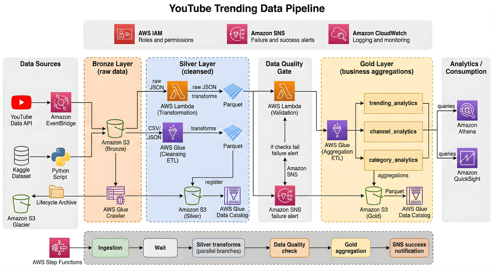

# Youtube Data Pipeline

## Introduction
This pipeline automates the end-to-end process of collecting, cleaning, and analyzing YouTube trending video data. It replaces manual Kaggle dataset downloads with live YouTube Data API v3 integration and produces three sets of business analytics tables:

- Trending Analytics — daily trending metrics per region (total videos, views, engagement rates)
- Channel Analytics — channel-level performance and ranking across regions
- Category Analytics — category-level breakdowns with view share percentages

The pipeline supports 10 regions and runs on a configurable schedule via AWS EventBridge.

## Architecture


## Technology Used
1. Programming Language - Python 3, PySpark
2. Scripting Language - SQL
3. Amazon Web Services
   - S3 (Parquet, Snappy)
   - Lambda (PySpark)
   - Glue (PySpark)
   - Athena
   - Step Functions
4. Libraries
   - Pandas
   - AWS Wrangler
   - Boto3

## Dataset Used
- YouTube Data API v3 — live trending video data (primary)
- Kaggle YouTube Trending Dataset — historical data for backfill and testing

## Data Model
A cloud-native ETL pipeline that ingests YouTube trending video data across 10 regions, transforms it through a medallion architecture (Bronze > Silver > Gold), enforces data quality gates, and produces analytics-ready aggregations — all orchestrated by AWS Step Functions.
```text
# YouTube Data Engineering Pipeline Architecture

```text
Data Sources          Bronze              Silver            Quality Gate          Gold              Analytics
┌──────────┐     ┌──────────────┐    ┌──────────────┐    ┌────────────┐    ┌──────────────┐    ┌──────────┐
│ YouTube  │     │              │    │              │    │            │    │  trending_   │    │          │
│ API v3   │────>│  Raw JSON    │───>│  Cleansed    │───>│  DQ Lambda │───>│  analytics   │───>│  Athena  │
│          │     │  (S3)        │    │  Parquet     │    │  Validates │    │              │    │          │
├──────────┤     │              │    │  (S3)        │    │  row count │    │  channel_    │    ├──────────┤
│ Kaggle   │     │  Raw CSV     │    │              │    │  nulls     │    │  analytics   │    │  Quick-  │
│ Dataset  │────>│  (S3)        │    │  Reference   │    │  schema    │    │              │    │  Sight   │
│          │     │              │    │  Parquet     │    │  freshness │    │  category_   │    │          │
└──────────┘     └──────────────┘    └──────────────┘    └────────────┘    │  analytics   │    └──────────┘
                                                              │           └──────────────┘
                                                         fail │
                                                              ▼
                                                        ┌────────────┐
                                                        │  SNS Alert │
                                                        └────────────┘

```


